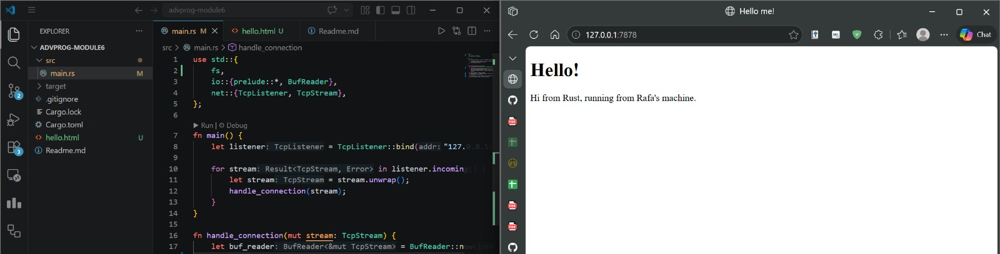
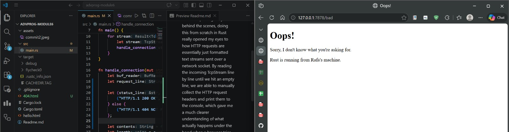

# Milestone 1:
For Milestone 1, I learned how to set up a basic TCP listener in Rust and read incoming HTTP requests using BufReader. Unlike my previous experience using heavy frameworks like Django where the framework handles all the low-level parsing for you behind the scenes, doing this from scratch in Rust really opened my eyes to how HTTP requests are essentially just formatted text streams sent over a network socket. By reading the incoming TcpStream line by line until we hit an empty line, we are able to manually collect the HTTP request headers and print them to the console, which gave me a much clearer understanding of what actually happens under the hood when a browser tries to connect to a local server.

# Milestone 2:
For Milestone 2, I learned how to construct a valid HTTP response to actually serve a web page back to the browser. Instead of just reading the incoming request, we use the fs module to read an HTML file into a string. The most interesting part was learning that a valid HTTP response requires a very specific, strict format: a status line indicating success (HTTP/1.1 200 OK), followed by headers (importantly, calculating the Content-Length so the browser knows how much data to expect), a mandatory empty line \r\n\r\n to separate headers from the body, and finally the actual HTML contents. Formatting this string correctly and writing it back to the TcpStream allows the browser to properly render the page.

# Milestone 3
For Milestone 3, I added logic to validate the incoming request and selectively respond with either a success page or a 404 error page. Initially, I realized that writing out the full if/else block led to a lot of duplicated code for reading the file, calculating the length, and formatting the response. To fix this, I refactored the code to extract only the parts that differ, the status_line and the filename, into a tuple assignment based on the request_line condition. I think this refactoring is needed because it keeps the code DRY (Don't Repeat Yourself), making it much cleaner, easier to maintain, and less prone to bugs if we want to change how responses are formatted or add new routes later.

# Milestone 4
For Milestone 4, I simulated a slow response by adding a /sleep route that pauses the current thread for 10 seconds. When testing this with multiple browser windows, I observed that requesting the normal root URL (/) right after requesting /sleep caused the second request to hang completely. This happens because our web server is currently single-threaded. It processes connections sequentially in a queue; while it is busy "sleeping" on the first request, it absolutely cannot move on to accept or parse the next incoming TCP connection. This basically shows a bottleneck where a single slow request (like a heavy database query) will freeze the entire server for all other users.

# Milestone 5
For Milestone 5, I resolved the single-thread bottleneck by implementing a ThreadPool. I learned how to use Rust's concurrency primitives, specifically mpsc (multiple producer, single consumer) channels to send closures (jobs) from the main thread to the worker threads. Because multiple workers need to share the same receiver, I had to wrap it in an Arc (Atomic Reference Counted pointer) to share ownership safely across threads, and a Mutex to ensure only one worker thread can pull a job from the queue at a time. Testing the /sleep route again shows that the server can now handle other requests instantly while one worker is busy.

# Bonus Reflection
For the Bonus, I refactored the ThreadPool instantiation by replacing the new function with a build function. In Rust's standard library conventions, a new function is generally expected to never fail (it shouldn't panic). However, creating a ThreadPool with a size of 0 is an invalid state that would cause our code to crash via the assert! macro. By changing it to build and returning a Result<ThreadPool, PoolCreationError>, I shift the error handling to the caller.